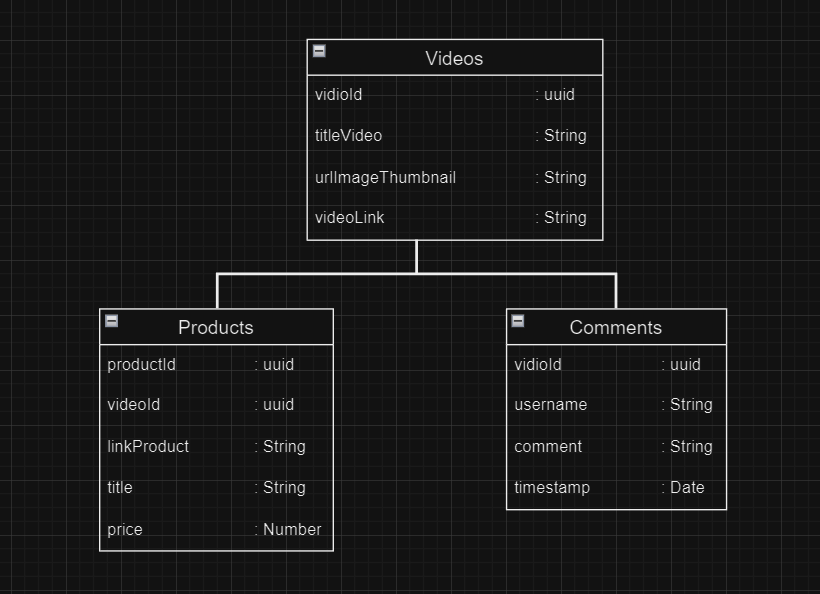
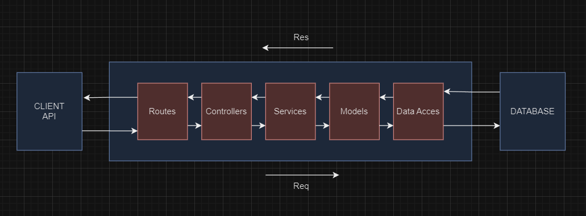

## This mid term project from GIGIH 3.0 Fullstack Developer

### About this project :

this project about tokopedia play clone, this is mid term from GIGIH 3.0
in this project build with MERN is
('mongoodb, express, reactJs and NodeJS').

##### _NOTED_ : to download the latest version of npm, on the command line, run the following command:

```bash
npm install -g npm
```

##### _NOTED_ : to install this project depedencies, run the following command:

```bash
npm install
```

### 1. Database Structure :

database have **3 collection** it's videos, product, comments :
product and comments have vidioId from vidios : videoId

##### _NOTED_ : to create **Database** in MONGOSH with name database is : tokpedPlayClone

```bash
    use tokpedPlayClone
```

##### and create **Collection** with Mongosh or MongoShell: **Products**

```bash
    db.createCollection("products")
```

##### and create **Collection** with Mongosh or MongoShell: **Videos**

```bash
    db.createCollection("videos")
```

##### and create **Collection** with Mongosh or MongoShell: **Comments**

```bash
    db.createCollection("comments")
```

##### Database Structure Design :



### 2. API Structure

#### API Structure Design :

on this structure API, I use folder structure :

**Data Acces :**

- Models :
- Services :
- Controllers :
- Routes :



### 3. List API request and response

#### GET /videos (all videos)

##### _METHOD GET_ Return all Videos in the system :

- URL Params : _None_.
- Data Params : _None_.
- Headers : Content-Type: application/json.

- Success Response :
  _CODE 200_.

_Result :_

```json
[
  {
    "titleVideo": "MITO Mesin Cuci Portable WM-1",
    "urlImageThumbnail": "https://images.tokopedia.net/img/cache/900/VqbcmM/2022/5/30/a857ff86-41c6-427b-9323-ea1fff6bce2f.jpg",
    "videoLink": "https://youtu.be/g6wYuztTw2c",
    "videoId": "e358ba51-ecd5-4305-8fcc-25bf46bc4830"
  }
]
```

- Error :
  _CODE 500_. : Internal server error

#### GET /by-title/:titleVideo (filter/search vidio)

##### \_METHOD GET by VideosID Return specified Videos :

- URL Params : `
VidioID=[uuid]`.
- Data Params : vidioId.
- Headers :
  Content-Type: application/json.

- Success Response :
  _CODE 200_. : succesed
  _CODE 404_. : Video not found

_Result :_

```json
[
  {
    "videoId": "7822253c-08c8-415b-ac96-1b70757811e3",
    "titleVideo": "Cubic Lemari Pakaian Minimalis",
    "urlImageThumbnail": "https://images.tokopedia.net/img/cache/900/VqbcmM/2022/10/7/7236a825-3ba4-4dad-b63c-809f7393e762.jpg",
    "videoLink": "https://youtu.be/NfixTeXW320"
  }
]
```

#### POST /videos

create a new videos and return the new object.

- URL Params :
  _NONE_
- Headers :
  Context-Type: application/json
- Data Params :

```json
[
  {
    "titleVideo": "Cubic Lemari Pakaian Minimalis",
    "urlImageThumbnail": "https://images.tokopedia.net/img/cache/900/VqbcmM/2022/10/7/7236a825-3ba4-4dad-b63c-809f7393e762.jpg",
    "videoLink": "https://youtu.be/NfixTeXW320"
  }
]
```

- Success Response :
  _CODE 201_. : succesed

- Error :
  _CODE 505_. : Internal server error

#### GET /products/:vidioId

Returns all products in the system.

- URL Params :
  _NONE_
- Data Params :
  _NONE_
- Headers
  Context-Type: application/json
- Success Response :
  _CODE 201_. : succesed
- Error :
  _CODE 500_. : Internal server error

_RESULT :_

```json
[
  {
    "productId": "6088b470-fe3a-4555-86da-008c65d24ceb",
    "videoId": "e358ba51-ecd5-4305-8fcc-25bf46bc4830",
    "linkProduct": "https://www.tokopedia.com/bhinnekaha/mito-mesin-cuci-portable-wm-1?extParam=ivf%3Dfalse%26src%3Dsearch",
    "title": "Mesin Cuci Portabel MITO",
    "price": 583002
  }
]
```

#### POST /product

create a new product and return the new object.

- URL Params :
  _NONE_
- Headers :
  Context-Type: application/json
- Data Params :

```json
[
  {
    "linkProduct": "https://www.tokopedia.com/bhinnekaha/mito-mesin-cuci-portable-wm-1?extParam=ivf%3Dfalse%26src%3Dsearch",
    "title": "Mesin Cuci Portabel MITO",
    "price": 583002
  }
]
```

- Success Response :
  _CODE 201_. : succesed

- Error :
  _CODE 505_. : Internal server error

#### GET /comments/:vidioId/comments

Returns all products in the system.

- URL Params :
  params:vidioId
- Data Params :
  _NONE_
- Headers
  Context-Type: application/json
- Success Response :
  _CODE 201_. : succesed
- Error :
  _CODE 500_. : Internal server error

_RESULT :_

```json
[
  {
    "videoId": "e358ba51-ecd5-4305-8fcc-25bf46bc4830",
    "username": "Ferry",
    "comment": "wah barangnya sangat keren",
    "timestamp": "2023-07-27T18:34:04.068Z"
  }
]
```

#### POST /comments/:videoId/comments

create a new product and return the new object.

- URL Params :
  _NONE_
- Headers :
  Context-Type: application/json
- Data Params :

```json
[
  {
    "username": "Zulkhifli",
    "comment": "wah barangnya sangat keren"
  }
]
```

### 4. How to run in local

##### _NOTED_ : How run the project, run the following command:

```bash
npm start / npm run start
```
